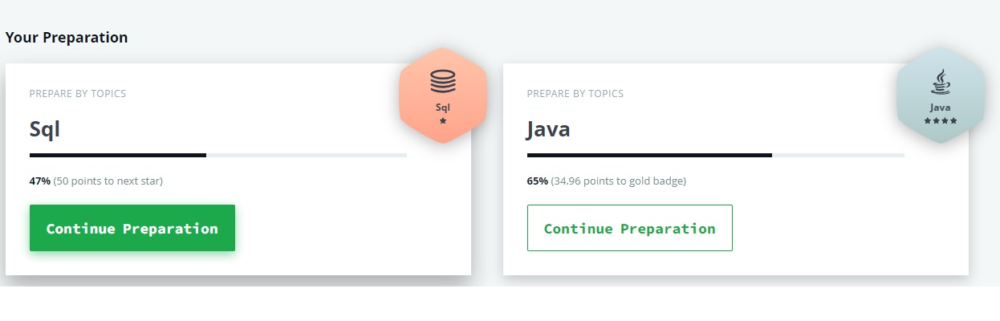

# Artyom Grigorev

## Junior Frontend Developer, web-designer

## Contact information:

**Phone**: +555 555 555

**E-mail:** artomgrigorev@gmail.com

**Telegram:** @artyomgrogorev


***

### About Myself
I constantly attend different courses on programming. I can work in a team (take responsibility, give tasks, read someone else's code)

**My hobby:** participation in hackathons, e -sports, reading technical literature


***

### Skills and Proficiency:
- HTML5, CSS3
- JavaScript Basics
- Git, GitHub
- VS Code, IntelliJ IDEA
- Adobe Photoshop, Illustrator, InDesign
- Java Basics
- C#, NET Basics


***

### Code example
**Peak array index KATA from CODEWARS:** Implement a function which convert the given boolean value into its string representation.
```
public class BooleanToString {
  public static String convert(boolean b){
    if(b) {
      return "true";
    } else {
      return "false";
    }
  }

}
```


***
### Courses: 
-Java Prepare [HackerRank](https://www.hackerrank.com/dashboard)



-JavaScript Manual on learnjavascript.ru (in progress)


-RS Schools Course «JavaScript/Front-end. Stage 0» (in progress)


***
### Languages:
-Russian - Native
-Ukrainian - Intermediate
-English - Basic

